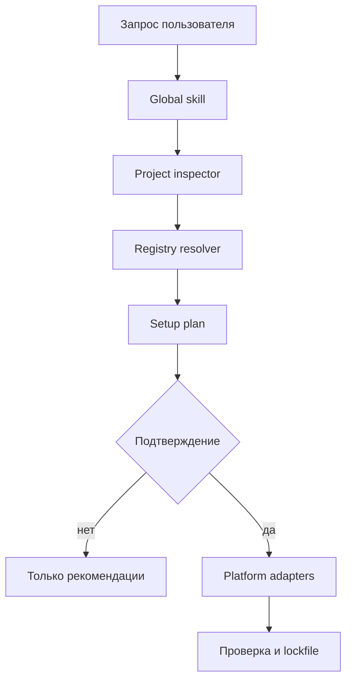

# Global Agent Setup: архитектура V1

## Цель

`global-agent-setup` превращает пользовательский запрос и состояние проекта в
проверяемый план окружения: какие skills, plugins, MCP-серверы и встроенные
инструменты нужны, что уже доступно, что отсутствует и какие изменения требуют
подтверждения.

Проект намеренно не хранит «огромную таблицу» внутри `SKILL.md`. Skill должен
оставаться коротким. Каталог компонентов — отдельный версионируемый набор данных,
доступный CLI и MCP-серверу.

## Граница V1

V1 работает локально и без сетевых зависимостей:

- инспектирует новый или существующий репозиторий;
- валидирует нормализованный JSON-каталог;
- ищет компоненты по запросу и сигналам проекта;
- строит setup-план с причинами, риском и точкой подтверждения;
- экспортирует каталог в CSV для анализа как большую таблицу;
- отдаёт те же операции через MCP stdio.

V1 не клонирует и не запускает произвольный код из GitHub. Это появится только
после отдельного конвейера доверия и установки.

## Поток выполнения



## Компоненты

| Компонент | Ответственность | Реализация V1 |
| --- | --- | --- |
| Skill | Понимает намерение, объясняет план, получает подтверждение | `skills/global-agent-setup/` |
| Inspector | Определяет стек, manifests и уже подключённые компоненты | `src/global_agent_setup/inspector.py` |
| Registry | Загружает и валидирует каталог | `src/global_agent_setup/registry.py` |
| Resolver | Ранжирует кандидатов и строит действия | `src/global_agent_setup/planner.py` |
| CLI | Локальный детерминированный интерфейс | `src/global_agent_setup/cli.py` |
| MCP adapter | Предоставляет inspect/search/plan агенту | `src/global_agent_setup/mcp_server.py` |
| Catalog | Нормализованные записи и provenance | `registries/catalog.json` |

## Модель каталога

Каждая запись содержит стабильный `id`, тип компонента, возможности, ключевые
слова, сигналы файлов проекта, совместимые платформы, источник, режим установки,
уровень риска и статус проверки. Источник всегда отделён от способа установки.

Критический принцип: запись каталога — кандидат, а не разрешение на запуск.
Популярность репозитория не заменяет аудит лицензии, закрепление commit SHA,
проверку install-скриптов и человеческое подтверждение.

## Конвейер каталога GitHub — следующий этап

1. Discovery получает кандидатов из разрешённых GitHub-источников.
2. Normalizer приводит README, manifest, license и release metadata к общей схеме.
3. Trust pipeline фиксирует commit SHA, лицензию, владельца и результаты сканеров.
4. Reviewer принимает или отклоняет запись и задаёт risk tier.
5. Publisher подписывает неизменяемый snapshot каталога.
6. Клиент обновляет snapshot, проверяет подпись и только затем использует записи.

Для большой базы локальный JSON заменяется API + PostgreSQL, но схема и
планировщик остаются совместимыми. CSV является представлением для человека,
не источником истины.

## Безопасность

- Планирование и изменение состояния — разные операции.
- По умолчанию разрешены только read-only inspect/search/plan.
- Никаких секретов в registry, plugin manifest или MCP environment.
- Git-источники должны закрепляться commit SHA и checksum.
- Install-команды не исполняются через shell-строку; только argv-массивом.
- Изменения вне корня проекта и пользовательских каталогов plugins/skills требуют
  отдельного разрешения среды.
- Установщик обязан вести lockfile и уметь объяснить каждое изменение.

## Команды разработчика

```bash
python3 scripts/global_agent_setup.py validate-registry
python3 scripts/global_agent_setup.py inspect --root .
python3 scripts/global_agent_setup.py search "browser github"
python3 scripts/global_agent_setup.py plan "Сделай full-stack приложение" --root .
python3 scripts/export_catalog_csv.py --output catalog.csv
python3 -m unittest discover -s tests -v
```

## Roadmap

1. V1: локальный registry, inspector, planner, CLI, MCP и dry-run.
2. V1.1: signed registry snapshots и GitHub ingestion worker.
3. V1.2: Codex plugin/skill installer adapters с подтверждением и lockfile.
4. V2: hosted registry API, reputation signals, policy engine и организациями
   управляемые allowlists.
5. V3: дополнительные адаптеры для других агентных клиентов.
